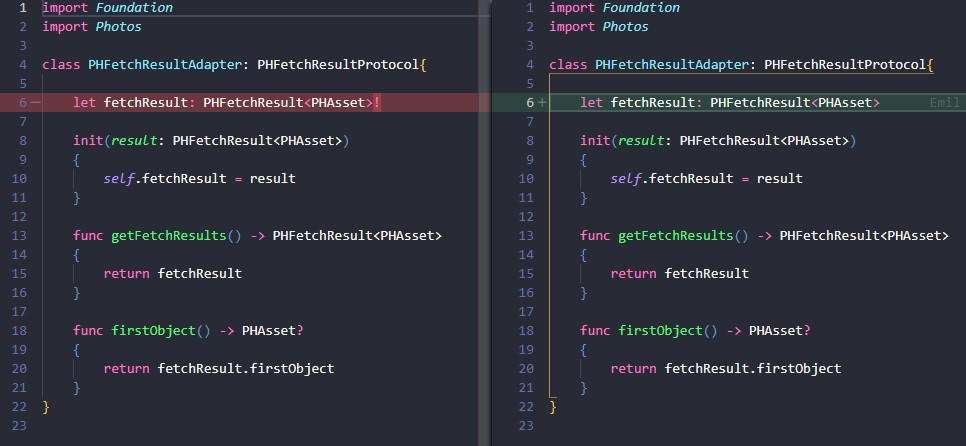

# TF² - Swift Optionals Edition
am Beispiel vom Backup SDK

---
<!-- paginate: true -->

# Backup was?

- SDK für die Hidrive App auf IOS und macOS
- Nur Backup und Restore Funktion
- App nicht von uns

---

# Optionals

```swift
// normale Variable
var a = 1        
var b = NSDate() 
var c:Int        // compile error
var d:NSDate     // compile error

print(c)         // error: variable 'c' used before being initialized

// Optionals
var e:Int?       // nil
var f:NSDate?    // nil

// Implicitly Unwrapped Optionals
var g:Int!       // nil
var h:NSDate!    // nil

```
---

```swift
var e:Int?
e = 3
print(e + 1)     // error!
print(e! + 1)

var g:Int!
g=3
print(g+1)       // OK

print(g!)        // error, if nil
```

---


---

```swift
class ViewController: UIViewController {
  @IBOutlet weak var textView: UITextView!  // not nil shortly before View init
  ...
}
```

---
 
## Example: IoC
```swift
class CalendarService: CalendarServiceProtocol{
    
    private let calendarRepository: CalendarRepositoryProtocol!
    private let fileIOService: FileIOServiceProtocol!
    
    init(calendarRepository: CalendarRepositoryProtocol? = IoC.resolveOrNil(),
         fileIOService: FileIOServiceProtocol? = IoC.resolveOrNil()) {

        self.calendarRepository = calendarRepository
        self.fileIOService = fileIOService
    }
}
```

---

## Besser

```swift
class CalendarService: CalendarServiceProtocol{
    
    private let calendarRepository: CalendarRepositoryProtocol
    private let fileIOService: FileIOServiceProtocol
    
    init(calendarRepository: CalendarRepositoryProtocol = IoC.resolveOrNil()!,
         fileIOService: FileIOServiceProtocol = IoC.resolveOrNil()!) {

        self.calendarRepository = calendarRepository
        self.fileIOService = fileIOService
    }
}
```

---

## Guarding

```swift
struct Animal {
    let species: String
    init?(species: String) {
        if species.isEmpty { return nil }
        self.species = species
    }
}

func isAnimalAlive (_ animal: Animal?) -> Bool {
    guard let notNilAnimal = animal else { return false }
    print(notNilAnimal)
    return true
}

let anim = Animal(species:"")
print(isAnimalAlive(anim))

```

---

```swift
func merge(_ mediaMetaData: MediaMetaData?) -> MediaMetaData? {
    guard let mediaMetaData = mediaMetaData else {
        return MediaMetaData(items: [])
    }
    return MediaMetaData(items: mediaMetaData.items)
}
```

```swift
func merge(_ mediaMetaData: MediaMetaData?) -> MediaMetaData {
    if mediaMetaData != nil { 
        return MediaMetaData(items: mediaMetaData!.items)
    } 
    return MediaMetaData(items: [])
}
```
---

## Example: Guard

```swift
open class Version : ... {
    ...
    init?(_ string: String) {
        let regex = try! NSRegularExpression(pattern: "^\\s*(\\d+)\\.(\\d+)\\s*$", options: [])

        guard let match = regex.firstMatch(
            in: string, options:[], range: NSRange(location: 0, length: string.length)
        ) 
        else 
        {
            return nil
        }
        ...
    }
    ...

    static func deserialize(_ str: Any?) throws -> Version {
        guard let versionString = str.string else {throw JsonError.serializationFailed}
        guard let v = Version(versionString) else {throw JsonError.serializationFailed}
        return v
    }
}
```

---

## Example: Wrapper mit Optionals

```swift
guard let asset = PHAsset.fetchAssets(withLocalIdentifiers: [video.id], options: nil).firstObject
    else { return Future<Void>(fail: BackupSDKError.mediaNoAssetWithGivenLocalId) }
```

```swift
class PHAssetsAdapter: PHAssetsProtocol{
    func fetchAssets(withLocalIdentifiers identifiers: [String]) -> PHFetchResultProtocol
    {
        let fetchAsset = PHAsset.fetchAssets(withLocalIdentifiers: identifiers, options: nil)
        return PHFetchResultAdapter(result: fetchAsset)
    }
}
```
---

```swift
class PHFetchResultAdapter: PHFetchResultProtocol{
    
    let fetchResult: PHFetchResult<PHAsset>!
    
    init(result: PHFetchResult<PHAsset>)
    {
        self.fetchResult = result
    }
    
    func getFetchResults() -> PHFetchResult<PHAsset>
    {
        return fetchResult
    }
    
    func firstObject() -> PHAsset?
    {
        return fetchResult.firstObject
    }
}
```
---


---

```swift
let fetchedAsset = self.pHAssetsAdapter.fetchAssets(withLocalIdentifiers: [video.id])
guard let asset = fetchedAsset.firstObject()
    else {
        return Future<Void>(fail: BackupSDKError.mediaNoAssetWithGivenLocalId)
}
```
<!-- Scoped style -->
<style scoped>
h1 {
  color: red;
}
</style>

# Fatal error: Unexpectedly found nil while unwrapping an Optional value

---

```swift
class PHFetchResultAdapter: PHFetchResultProtocol{
    
    let fetchResult: PHFetchResult<PHAsset>!
    
    init(result: PHFetchResult<PHAsset>)
    {
        self.fetchResult = result
    }

    ...

    func firstObject() -> PHAsset?
    {
        return fetchResult.firstObject
    }
}
```

---



---


# Was tun?

- Fail early, am besten zur compilezeit
- So früh, wie möglich loswerden mit 
    - ```guard``` / ```if let``` / Nil-Coalescing Operator (```self.state = newState ?? .default```)
- Nur im Ausnahmefall nutzen
    - ```@IBOutlet weak var myLabel: UILabel!```
- Native Klassen, die es benutzen adaptieren / wrappen
- Bei Adaptern/Wrappern aufpassen!
- Failable Initializer: Don't!

---

# Andere Meinungen

[OPTIONALS IN SWIFT — FLUCH ODER SEGEN?](https://kofler.info/optionals-in-swift-fluch-oder-segen/)
[Swift: Banning force unwrapping optionals](https://blog.timac.org/2017/0628-swift-banning-force-unwrapping-optionals/)
[Stack Overflow - Why would you create a "Implicitly Unwrapped Optional"?](https://stackoverflow.com/questions/24006975/why-create-implicitly-unwrapped-optionals-since-that-implies-you-know-theres)
[SonarSource - Implicitly unwrapped optionals should not be used](https://rules.sonarsource.com/swift/RSPEC-1438?search=optionals)
[THE IMPLICITLY UNWRAPPED OPTIONAL & WHEN TO USE IT](https://krakendev.io/blog/when-to-use-implicitly-unwrapped-optionals)


---

# Coole Swift Dinge
- Vermeidung von Nil zur compilezeit
- ```@testable import``` ...
- Error Handling
```swift
func handleFailedRestore() throws {
    try fileManager.createDirectory(
        atPath: folderPath, withIntermediateDirectories: true, attributes: nil
    )
}
```
---

```swift
func getTotalRemainingFreeSpaceInBytes() -> Int64? {
    let documentDirectory = NSSearchPathForDirectoriesInDomains(
        .documentDirectory, .userDomainMask, true
    ).last!
    guard
        let systemAttributes = try? FileManager.default.attributesOfFileSystem(
            forPath: documentDirectory
        ),
        let freeSize = systemAttributes[.systemFreeSize] as? NSNumber
    else {
            return nil
    }
    return freeSize.int64Value
}
```

---

[https://github.com/limered/talks](https://github.com/limered/talks)