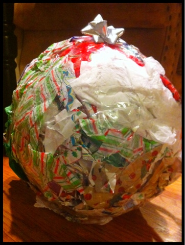

# Was ist das hier?

- Vorstellung verschiedener <green>Refactorings, Entwicklungsmuster</green> oder <green>Methoden</green>
- Live Programming
- <pink>Schwierigkeitslevel, Zielgruppe, Vorwissen</pink> werden in Einladung angegeben
- Fragen können zu jeder Zeit gestellt werden
- Geplant regelmäßig und sich wiederholend
- Verbesserungsvorschläge willkommen 

---

# Patterns
# Wrapping - Basics

<center>


</center>

---


### Introduce Instance Delegator (oder so ähnlich) <- Wrapping right here

<center>


</center>

1. Extract Interface
1. Delegate Methods
1. ...
1. Profit


---
<!-- paginate: true -->

## Problem 1: Testen von statischem Code

```cs
public async Task Execute(CancellationToken ct)
{
    ...
    await FinalizeBackup(ct);
    ...
}
```

```cs
private async Task FinalizeBackup(CancellationToken ct)
{
    ct.ThrowIfCancellationRequested();
    await _remoteBackupJson.SetFinishDate(DateTime.Now);
}
```

---

```cs
public async Task SetCurrentTimeStamp(){
    await _cut.Execute(new CancellationToken());

    _remoteBackupJsonMock
        .Verify(json => json.SetFinishDate(DateTime.Now), Times.Once())
}
```

# <red>Fail</red>
---

```cs
public async Task SetCurrentTimeStamp(){
    await _cut.Execute(new CancellationToken());

    _remoteBackupJsonMock
        .Verify(json => json.SetFinishDate(DateTime.Now), Times.Once())
}
```

# <red>```DateTime.Now```</red> ist statisch und immer neu

---

# Lösung: Wrap that shit!

<center>



</center>

---

## Wie?

```cs
public class SimpleWrapper : IOriginal
{
    public string WrappedStaticMethod()
    {
        return Original.StaticMethod()
    }
}
```

---

Extract Interface

```cs
public interface IDateTime
{
    DateTime Now {get; }
}
```

Delegate Method

```cs
public class DateTimeAdapter:IDateTime
{
    public DateTime Now => DateTime.Now;
}
```

---

Constructor Injection

```cs
public class BackupWorker : IBackupWorker
{
    private readonly IDateTime _dateTimeAdapter;

    public BackupWorker(IDateTime dateTimeAdapter)
    {
        _dateTimeAdapter = dateTimeAdapter;
    }
}
```
Usage
```cs
private async Task FinalizeBackup(CancellationToken ct)
{
    ct.ThrowIfCancellationRequested();
    await _remoteBackupJson.SetFinishDate(_dateTimeAdapter.Now);
}
```

---

```cs
public async Task SetCurrentTimeStamp(){
    var now = DateTime.Now;

    _dateTimeAdapterMock
        .Setup(adapter => adapter.Now)
        .Returns(now)

    await _cut.Execute(new CancellationToken());

    _remoteBackupJsonMock
        .Verify(json => json.SetFinishDate(now), Times.Once())
}
```
# <green>Pass</green>

---

## Problem 2: Das gleiche, nur mit <pink>```new```</pink>

```cs
public void CreateAutoStartShortcut(string executableFullPath)
{
    try
    {
        var shell = new IWshRuntimeLibrary.WshShell();
        var startupShortcut = (IWshShortcut)shell.CreateShortcut(_autoStartFolderPath);
        startupShortcut.TargetPath = executableFullPath;
        startupShortcut.IconLocation = _appService.IconPath;
        startupShortcut.Arguments = "/hideexp";
        startupShortcut.Save();
    }
    catch (Exception ex)
    {
        _logger.Error("Failed to create startup shortcut", ex);
    }
}
```
---
# More wrapping!
<center>


</center>

---

<center>


</center>

---
## Wrapper+
```cs
public class MoreWrapper : IOriginal
{
    private Original _original;

    public MoreWrapper(Original original)
    {
        _original = original;
    }

    public string WrappedInstanceMethod()
    {
        return _original.InstanceMethod()
    }
}
```

---

Extract Interface
```cs
public interface IWshShell
{
    object CreateShortcut(string autoStartFolderPath);
}
```

---

Delegate Method
```cs
public class WshShellAdapter : IWshShell
{
    private readonly WshShell _shell;
    
    public WshShellAdapter(WshShell shell)
    {
        _shell = shell;
    }

    public object CreateShortcut(string autoStartFolderPath)
    {
        return _shell.CreateShortcut(autoStartFolderPath);
    }
}
```

---

Use (From IoC)
```cs
public void CreateAutoStartShortcut(string executableFullPath)
{
    try
    {
        var shell = IoC.Resolve<IWshShell>();
        var startupShortcut = (IWshShortcut)shell.CreateShortcut(_autoStartFolderPath);
        startupShortcut.TargetPath = executableFullPath;
        startupShortcut.IconLocation = _appService.IconPath;
        startupShortcut.Arguments = "/hideexp";
        startupShortcut.Save();
    }
    catch (Exception ex)
    {
        _logger.Error("Failed to create startup shortcut", ex);
    }
}
```

---

Use (From Parameter)
```cs
public void CreateAutoStartShortcut(string executableFullPath, IWshShell shell)
{
    try
    {
        var startupShortcut = (IWshShortcut)shell.CreateShortcut(_autoStartFolderPath);
        startupShortcut.TargetPath = executableFullPath;
        startupShortcut.IconLocation = _appService.IconPath;
        startupShortcut.Arguments = "/hideexp";
        startupShortcut.Save();
    }
    catch (Exception ex)
    {
        _logger.Error("Failed to create startup shortcut", ex);
    }
}
```
---
Construction
```cs
public void HandleStartupShortcutOnStart(bool shortcutShouldExist, string executableFullPath)
{
    if (shortcutShouldExist)
    {
        CreateAutoStartShortcut(
            executableFullPath, 
            new WshShellAdapter(new IWshRuntimeLibrary.WshShell()));
    }
    if (!shortcutShouldExist && ExistsAutoStartShortcut())
    {
        DeleteAutoStartShortcut();
    }
}
```

## <green>Geht's besser?</green>

---

<center>


</center>

---

## Was macht das Ding so geil!

* <green>Einfacheres Testen</green> durch Kapselung und Entkopplung
* Extrem Wirkungsvoll mit IoC
* Refactorings können begrenzt werden / müssen nicht ausarten
    ```cs
    public class OriginAdapter : IOrigin{
        public Origin Original { get; }
    }
    ```
* Spätere <green>Änderung des Unterbaus</green> möglich
* Abgrenzung von Fremdcode
---

## Nachteile
* Mehr Code
* Steigerung der Programkomplexität
* Kann sich sinnlos anfühlen
* Widerspricht Faulheit
* Manchmal alternative Lösungen besser (bsp mocking in JavaSkript)


---

## Geiler Scheiß aber wann benutze ich das?
* <orange>Applikationsgrenzen</orange>
* <orange>Schnittstellen</orange> zu Fremdcode / Legacy Code
* Aufrufe von <orange>statischen</orange> Methoden/Klassen
* Services ohne Interfaces

---

<center>

[https://github.com/limered/talks](https://github.com/limered/talks)

</center>
